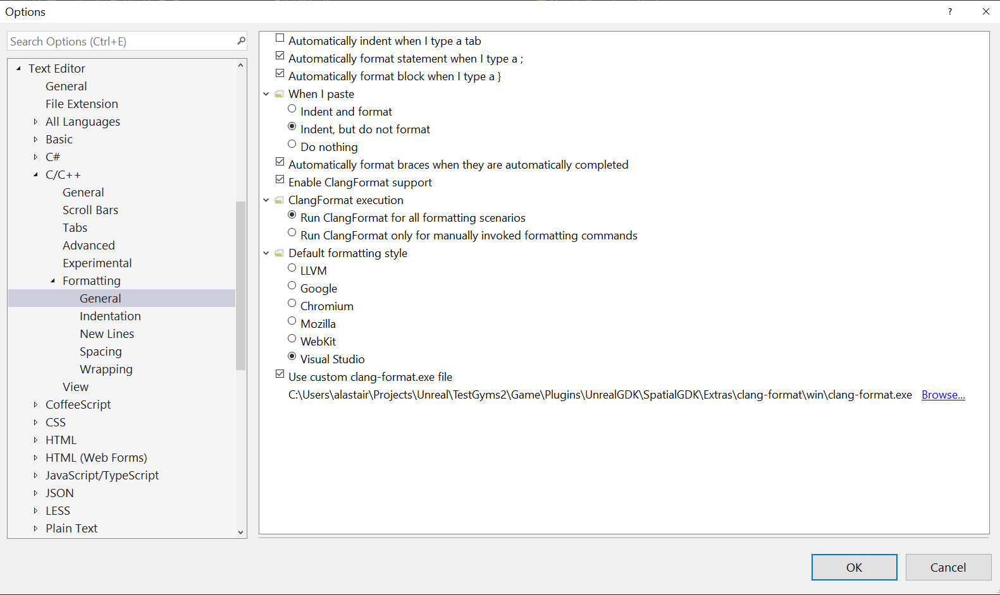
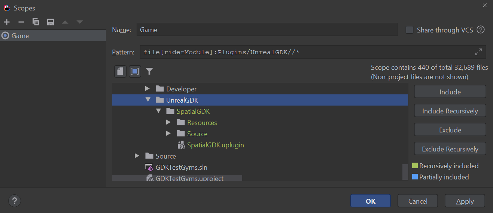
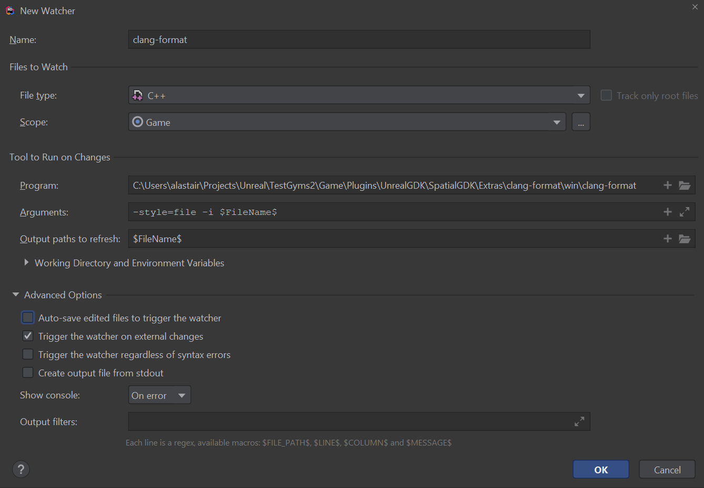

# Introduction
[Clang-format](https://clang.llvm.org/docs/ClangFormat.html) is a tool to automatically format C/C++/Objective-C code.

The GDK has a clang-format config file defined in `SpatialGDK/Source/.clang-format` which we run on all `.h/.cpp` files in the `SpatialGDK/Source` folder.

We have a pre-commit hook to run `clang-format` against changed files (via git diff). We also recommend you setup your IDE to make sure that all code files are always formatted on save. 

The GDK uses version 11 of `clang-format`. Different clang-format versions are usually not backwards-compatible and will reformat code, sometimes in subtle ways. You should only use the submitted binary within the GDK to format your code.

# Installation
You do not need to do any additional installation for the pre-commit hook to work.

## Using with Visual Studio
Visual Studio needs to reference the `clang-format` binary in the GDK plugin folder.

Go to `Tools` > `Options` > `Text Editor` > `C/C++` > `Formatting`.

Tick the `Enable ClangFormat support` box.

Hit `Browse` under `Use custom clang-format.exe file`, and navigate to the `clang-format` binary in the GDK folder, as shown.

Formatting a document in visual studio can be invoked by hitting the shortcut Ctrl+K Ctrl+D (you can keep Ctrl held down and then press K and then D).

However, there is a Visual Studio extension called Format Document on Save which will format the document whenever it’s saved.

## Using with Rider
In Rider, set up a file watcher for all C++ code files in the relevant modules (recursively). This will always execute on save.

Go to `File` > `Settings` > `Tools` > `File Watchers`.

Click the `+` icon in the top-right.

In the `Scope` field, add a new Scope:

and fill out the rest of the watcher like this:

