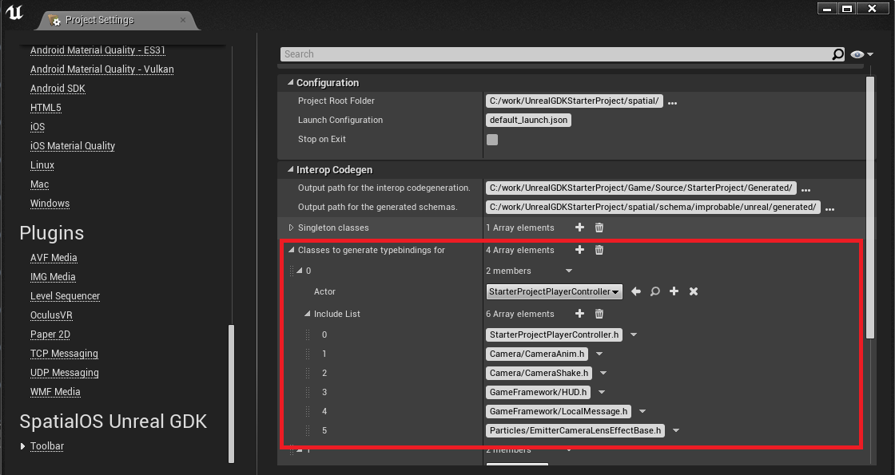

> This [pre-alpha](https://docs.improbable.io/reference/13.1/shared/release-policy#maturity-stages) release of the SpatialOS Unreal GDK is for evaluation and feedback purposes only, with limited documentation - see the guidance on [Recommended use](../../README.md#recommended-use).

# Interop Code Generator (ICG)

The Interop Code Generator (ICG) is part of the SpatialOS Unreal GDK toolbar. It takes a set of Unreal classes and generates routing code (called ["type bindings"](./glossary.md#type-bindings)) that enables automated communication between Unreal and SpatialOS.

The ICG creates SpatialOS `.schema` files from `UObject` class layouts via Unreal's reflection system (a system in Unreal for programs to self-examine). See the Unreal website’s blog on [the reflection system](https://www.unrealengine.com/en-US/blog/unreal-property-system-reflection) and SpatialOS [documentation on schema](https://docs.improbable.io/reference/13.1/shared/schema/introduction).

The `.schema` files enable SpatialOS to understand and store Unreal data. The ICG also creates `SpatialTypeBinding` classes (known as [type bindings](./glossary.md#type-bindings”)).

You will want to generate type bindings for all **replicated Actors** and **replicated Actor Components** in your project.

These classes:
* convert entity property updates to and from SpatialOS in the form of [component updates](https://docs.improbable.io/reference/13.1/csharpsdk/using/sending-data#sending-and-receiving-component-updates).
* send and receive Unreal RPCs (remote procedure calls) via [SpatialOS commands](https://docs.improbable.io/reference/13.1/shared/design/commands).
* have logic to handle conditional replication based on Unreal Actor ownership.

> [Known Issue](../known-issues.md): the ICG is not optimized.

## Running the Interop Code Generator (ICG)

### When to use the ICG
You need to use the ICG to generate `.schema` files and type bindings for any new native class or new Blueprint class that you want to replicate (for simplicity we’ll call these “user-defined classes”) representing new features in your game.

### How to use the ICG
As the Interop Code Generator is an plugin for the Unreal toolbar, to use it you must first:
*  build your game project to access the SpatialOS fork of Unreal Engine as well as the Unreal GDK. (You do this as part of the [installation and setup](../setup-and-installing.md), swapping the “Starter Project” and its file location for your game’s name and file location.)
* List the classes that you want create typebindings for in the `SpatialGDKEditorSettings` from within the editor. See  [Setting up the Interop Code Generator](#Setting-up-the-Interop-Code-Generator), below.

The SpatialOS build of Unreal has an **Interop Codegen** button; on the SpatialOS Unreal GDK toolbar, select **Interop Codegen** to trigger the ICG process:

## Setting up the Interop Code Generator

In order for the ICG to run correctly, you need to add any new user-defined class, along with its dependencies, in the `SpatialOS Unreal GDK` settings in the Unreal Engine 4 Editor tab before you run it.

Using the Unreal GDK Starter Project as an example, to do this:
1. Go to ** Edit > Project Settings... > SpatialOS Unreal GDK > Toolbar **.
1. In the entry `Classes to generate typebindings for`, add your user-defined class and the include dependencies that the typebinding require to compile.

If you want more information on the settings available through the Unreal GDK toolbar, then have a look at the [settings section in the toolbar docs](./toolbar.md#Settings).

### Example

The image below demonstrate how we setup the class `StarterProjectPlayerController` from the [Unreal GDK Starter Project’s](https://github.com/spatialos/UnrealGDKStarterProject), which depends on the include files `StarterProjectPlayerController.h`, `Camera/CameraAnim.h`, `Camera/CameraShake.h`, `GameFramework/HUD.h`, `GameFramework/LocalMessage.h` and `Particles/EmitterCameraLensEffectBase.h`.

This generates the appropriate `.schema` files and type bindings as `SpatialTypeBinding` files. Using the Starter Project example:

* The generated `.schema` files are in the Starter Project repository. They are at `<project root>/spatial /schema/improbable/generated/`.
The `.schema` files have names relevant to the class name you give them. From the Starter Project example above: `StarterProjectPlayerController.Schema` and `PlayerCharacter.schema`.

    Some `.schema` files have a `Types` tag;  in this situation `PlayerCharacter.schema` files have the filename `PlayerCharacterTypes.schema`.  This indicates this is a schema containing RPC types which child or sibling classes can reuse.

* The generated `SpatialTypeBinding` files are in the [Unreal GDK repository](https://github.com/spatialos/UnrealGDK) at `<Project Root>/workers/unreal/Game/source/GameName/Generated/`.

### Editing the Interop Code Generator tool
If you edit the Interop Code Generator tool itself, you might wish to delete the ICG generated folders as they can cause compilation issues if any of your changes introduce badly generated code.

[//]: # (Editorial review status: Full review 2018-07-13)
[//]: # (Issues to deal with, but not limited to:)
[//]: # (1. Update note about current lack of optimisation - JIRA: UNR-412)
[//]: # (2. Add screenshot of toolbar)
