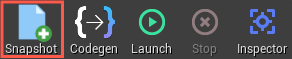

# Snapshots

If you're not familiar with snapshots in the context of SpatialOS, please look at the [full snapshot documentation](https://docs.improbable.io/reference/13.1/shared/operate/snapshots) (SpatialOS documentation).

The SpatialOS Unreal GDK snapshots have two kinds of entities in them: critical entities and placeholders.

### Critical entities

Critical entities are entities which are utilized for functionality critical to the GDK and are never deleted. They are saved into the initial snapshot and must always exist when launching a deployment.

Currently the critical entities are:
* `SpatialSpawner` - an entity with the `PlayerSpawner` component which has a command. Connecting clients use this entity to spawn their player.
* `GlobalStateManager` - an entity with the `GlobalStateManager` component which has a map of singleton classes to entity IDs. This entity is used for orchestrating the replication of [Singleton Actors](./singleton-actors).

### Placeholders

These entities exists only to set up server boundaries in a way that is easy to test in a two-server scenario. They will not spawn as actors when checked out and serve no purpose within the GDK. For most intents and purposes, you can safely ignore them.

## Generate a snapshot

To generate a snapshot, use the **Snapshot** button on the SpatialOS Unreal GDK toolbar in the Unreal Editor. This creates a snapshot called `default.snapshot` in `spatial\snapshots`.

 

You only need to regenerate snapshots when changing the `SnapshotGenerator.SingletonActorClasses` section in `DefaultEditorSpatialGDK.ini`. For more information, see [Singleton Actors](./singleton-actors).