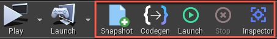
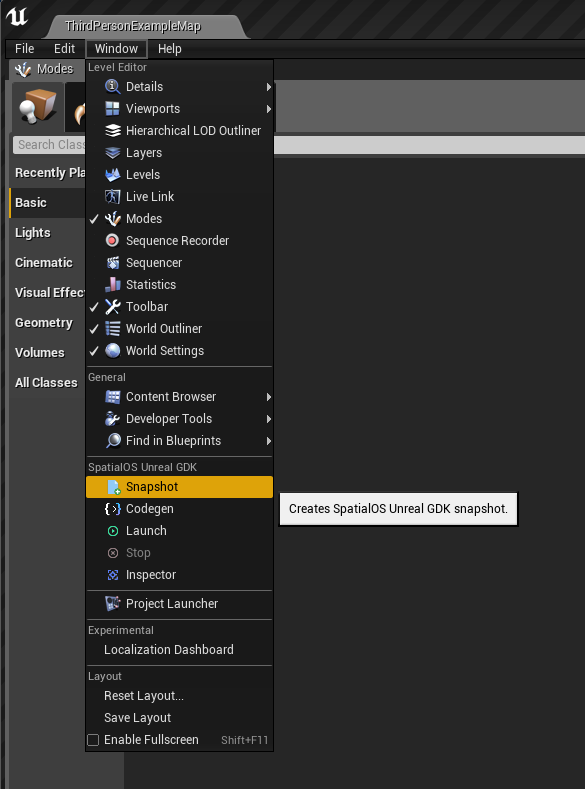
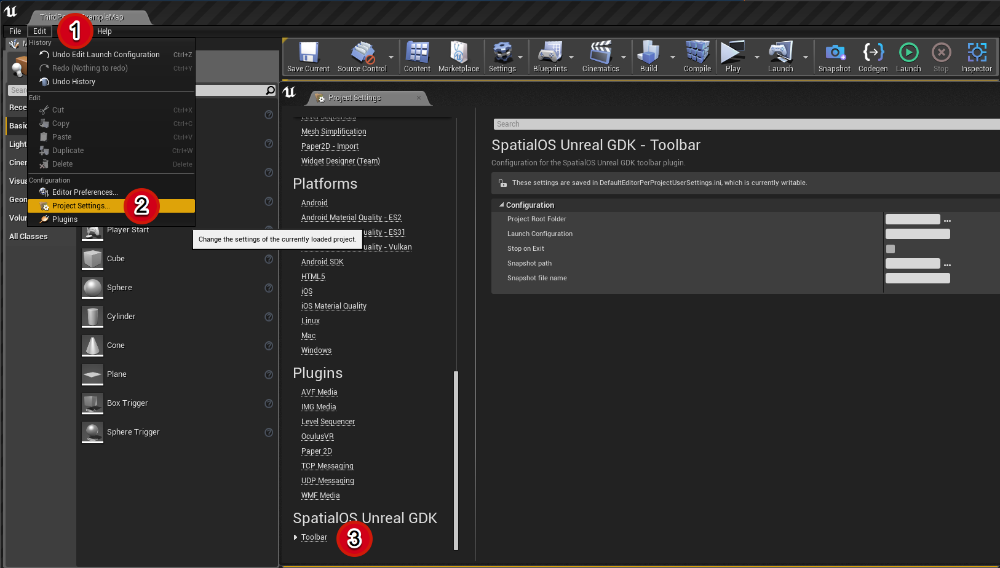

# The SpatialOS Unreal GDK toolbar

The SpatialOS Unreal GDK toolbar is an easy way to run and alter [`spatial` command-line tool (SpatialOS documentation)](https://docs.improbable.io/reference/13.1/shared/glossary#the-spatial-command-line-tool) commands from inside the Unreal editor.

## Add the SpatialOS Unreal GDK toolbar to your Unreal project

To enable the SpatialOS Unreal GDK toolbar:


1. Add a dependency to the plugin in your Unreal project file.

	Either:
	* Open your Unreal project's `.uproject` file in a text editor and add the SpatialOS Unreal GDK toolbar in the `Plugins` section:
	    ```
	    "Plugins": [
	        {
	            "Name": "SpatialGDKEditorToolbar",
	            "Enabled": true
	        }
	    ],
	    ```
        
   Or:
	* Inside the Unreal Editor, navigate to **Edit > Plugins** and scroll down
	to the bottom. Select the **SpatialOS Unreal GDK** section and enable the toolbar:

		


## SpatialOS Unreal GDK toolbar

The SpatialOS Unreal GDK toolbar has five features mapped to individual buttons, and is displayed in the main editor toolbar to the right of the `Launch` button. 

 

You can also access these from the **Window** menu:

 


* Snapshot

    Generates a [SpatialOS snapshot (SpatialOS documentation)](https://docs.improbable.io/reference/13.1/shared/glossary#snapshot).

* Codegen

    Creates [SpatialOS Unreal GDK interop code](./codegen.md).

* Launch

    Runs `spatial local launch` with the launch configuration specified in the settings (see [below](#settings)).

* Stop

    Stops `spatial local launch`.

* Inspector

    Opens the [Inspector (SpatialOS documentation)](https://docs.improbable.io/reference/13.1/shared/glossary#inspector) in a browser.

## Settings

The toolbar settings are in **Edit > Project Settings > SpatialOS Unreal GDK > Toolbar**.

 


* Project Root Folder

    By default, this points to the root folder of your SpatialOS Unreal GDK project. If you're using a non-standard structure, you'll need to set this yourself.

* Launch Configuration

    The [launch configuration file (SpatialOS documentation)](https://docs.improbable.io/reference/13.1/shared/reference/file-formats/launch-config) to use when running `spatial local launch` using the `Launch` button.

* Stop on Exit

    If enabled, shuts down running deployments when you close the Unreal Editor.
