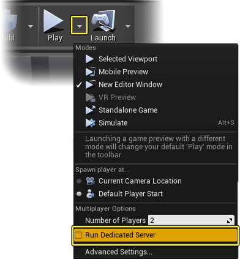

# Known issues
The focus of the Unreal GDK is improving SpatialOS interoperability with UE4 native code. We have made some temporary code organisation, feature coverage and efficiency trade-offs to expedite implementation.

Note that we will address the majority of the items below in line with our short term roadmap.

*  `FName`s are not supported.
* For more miscellaneous caveats, see the [MVP caveats Google document](https://docs.google.com/document/d/1dOpA0I2jBNgnxUuFFXtmtu_J1vIPBrlC8r1hAFWHF5I/edit).  (TODO fix for external users [JIRA TICKET](https://improbableio.atlassian.net/browse/UNR-304))

## Unsupported features
**Listen Server** is the default multiplayer hosting option. We have not tested this extensively, so choose **Dedicated Server** as the host. 
To do this, on the Unreal toolbar, click on the drop-down next to **Play** and check  **Run Dedicated Server**.

_Image: In the Unreal toolbar choose the **Run Dedicated Server** hosting option._